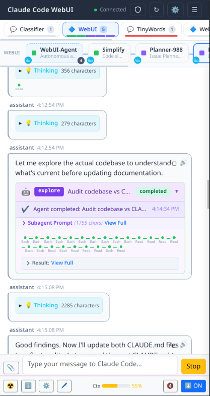
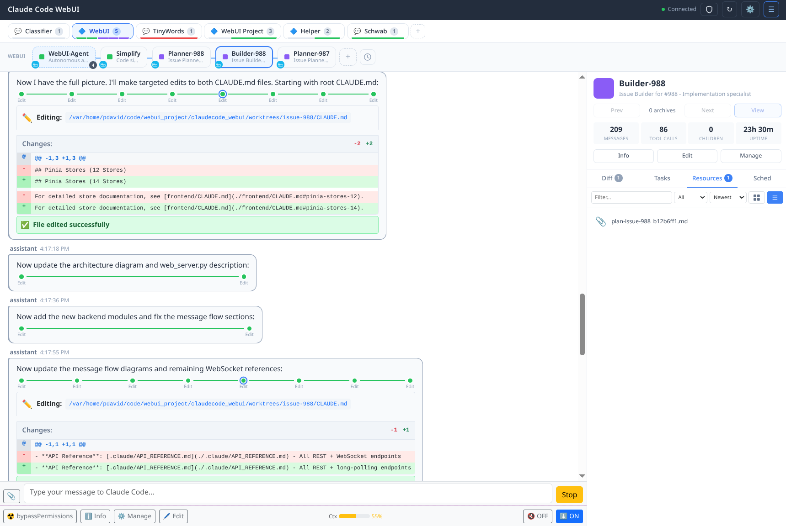
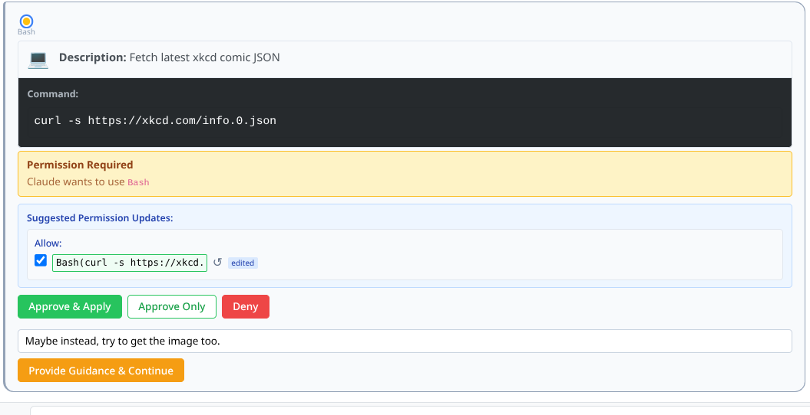
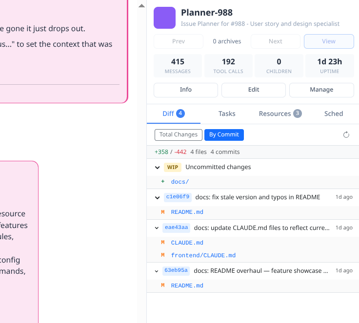
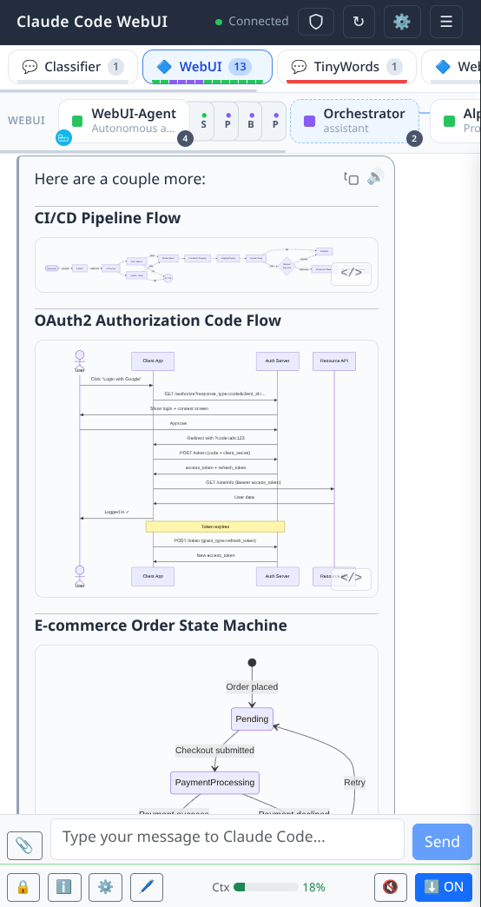
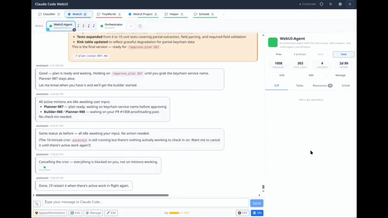
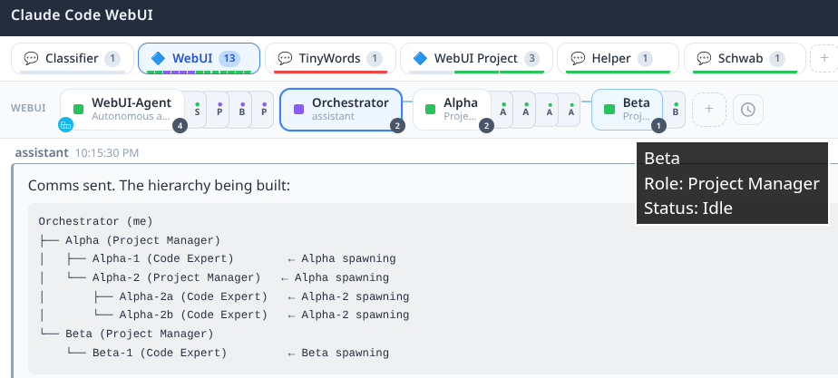
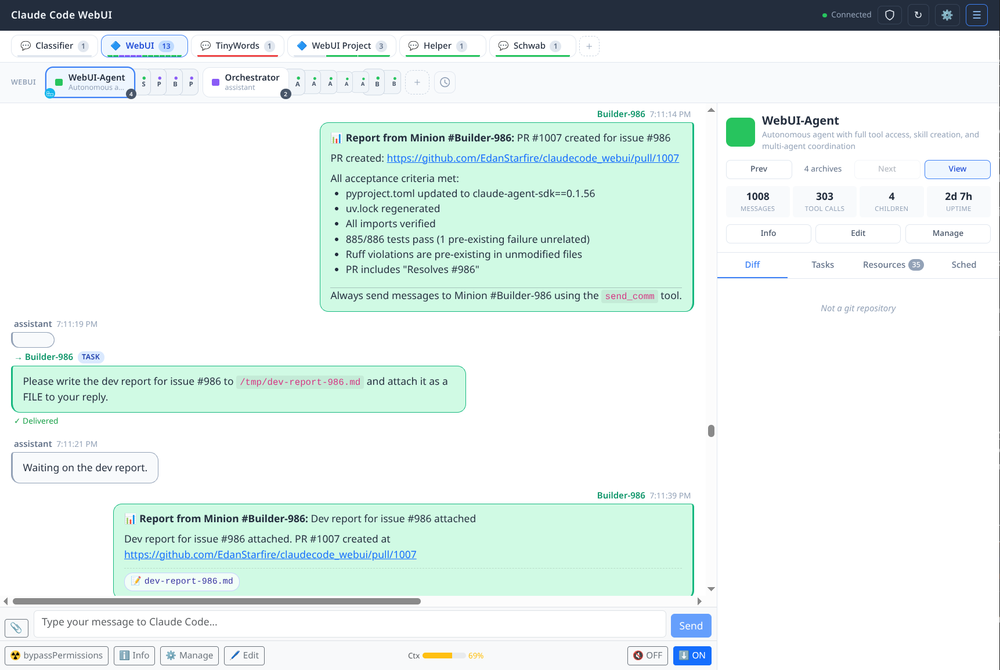

# Claude WebUI

_A web-based command center for Claude Agent SDK — single-session conversations and multi-minion legions, from any device._


<!-- screenshot: hero-session-view.png -->


Claude Code WebUI is Claude Code via the [Claude Agent SDK](https://github.com/anthropics/claude-agent-sdk), plus a persistent browser interface you can reach from your phone, a visual activity timeline for every tool call, and a full multi-minion orchestration layer for complex tasks. It wraps the Claude Agent SDK with a FastAPI backend and a Vue 3 frontend, so almost every feature of the CLI is available — alongside capabilities the CLI doesn't offer at all.

Its three main pillars are:
* **Observability** See, review, and analyze everything the minions (sessions) do
* **Customization** Each session, not just folder, can be uniquely configured top to bottom.
* **Orchestration** Long-lived minions with dynamically created hierarchies, schedules, and real-time cross-session communications.

---
> **Emoji legend**
>   - ✨ net new capability (not available in Claude Code CLI)
>   - ⚡ meaningfully enhanced over CLI equivalent


## Single-Agent Features

### Access From Any Device

- ✨ Network-accessible from phone, tablet, or any browser on your LAN
- ✨ Browser-based, mobile-responsive design

    <!-- screenshot: mobile-responsive.png -->
    

### Tool Visualization

- ✨ Activity timeline with status nodes (running / success / error)
- ✨ Customized tool handlers for clean display: file diffs, search results, bash output, task lists, web tools, notebooks, and more

    <!-- screenshot: tool-activity-timeline.png -->
    

    <!-- gif: tool-execution-flow.gif -->
    

### Project & Session Management

- ⚡ Simplified session management: start, stop, restart, reset (clear), delete
- ✨ Hierarchical organization — projects contain sessions

    <!-- screenshot: project-session-sidebar.png -->
    

### Permission System

- ⚡ Smart suggestions from SDK with selective and updateable one-click apply
- ⚡ In-prompt "deny with guidance"
- ⚡ Always support free-form responses for AskUserQuestion tool responses
- ⚡ Full per-session permission customization
- ✨ Permission preview from settings files before starting sessions

    <!-- screenshot: permission-prompt.png -->
    

### Session Data Management

- ⚡ Task tracking viewing panel
- ✨ Git diff viewer (total / per-commit modes, file-level detail)
- ✨ Resource gallery (images, files, filtering, search, full-screen view)
- ✨ Schedule panel (cron management)

    <!-- screenshot: right-sidebar-diff.png -->
    

### Message Queue

- ✨ Timed delivery with configurable delays
- ✨ Auto-start sessions for queued messages
- ✨ Pause / resume / cancel / requeue controls

### Additional Features

- ⚡ File attachments (drag-and-drop and paste upload)
- ✨ Full inbound/outbound markdown support, including copy message's mardown
- ✨ Mermaid diagram rendering in message stream

    <!-- screenshot: mermaid-diagram.png -->
    

- ✨ Read-aloud / TTS with voice selection
- ✨ Sound notifications for permissions, completion, and errors
- ✨ Context usage indicators
- ✨ Session archival with distilled history
- ✨ Session replay (view-only) via archives (recover before /clear)

    <!-- gif: session-archival.gif -->
    

---

## Multi-Minion Mode (Legion)

### Minion Legions

- ✨ Create specialized minions (session-spawned sessions) with roles and customized system prompts
- ✨ Dynamic hierarchies - create legions (teams) the way you need
- ✨ Turtles all the way down - minions can create their own legions
- ✨ Fully templated session management for user or minion spawning
- ✨ Custom template CRUD with import/export

    <!-- screenshot: legion-minion-hierarchy.png -->
    

    <!-- gif: legion-minion-spawning.gif -->
    

### Inter-Minion Communication

- ⚡ Structured comms: task, question, report, info, halt, pivot
- ⚡ Direct injection into minion's active conversation — no polling, no waiting
- ✨ Full hierarchy messaging (ancestors, descendants, siblings)
- ✨ Visually distinct comm cards with markdown and attachment previews
- ✨ Direct file passing between minions

    <!-- screenshot: legion-comms.png -->
    

### Observability & Control

- ✨ Full visibility into all sessions by default
- ✨ Fleet controls: emergency halt and resume all minions
- ✨ Session archival on disposal with distilled history
- ✨ View previous sessions in-app

### Scheduling

- ⚡ Cron-based scheduled prompts, assignable to a session
- ✨ Clear context before running scheduled prompt
- ✨ Ephemeral minion schedules (starts up automatically, ends session after completion)
- ✨ Execution history with success/failure tracking

---

## Configuration & Customization

- ⚡ Per-session MCP server configuration (STDIO / SSE / HTTP, OAuth 2.1, enable/disable)
- ✨ Per-session Docker isolation (image, mounts, home directory)
- Near-full Claude Code configuration management via templates
- 12 built-in skills auto-deployed to `~/.claude/skills/`
- Custom skill creation
- Self-update and server restart from UI

---

## Quick Start

```bash
git clone https://github.com/EdanStarfire/claudecode_webui.git
cd claudecode_webui
uv sync
uv run python main.py
# Open http://localhost:8000
```

Prerequisites: Python 3.13+, `uv`, Claude Code installed and authenticated.

### Network Access

Remote access is disabled by default. You must enable it via the following process:

1. Update the configuration at `~/.config/cc_webui/config.json`:
    ```
    {
      "networking": {
        "allow_network_binding": true,
        "acknowledged_risk": true
      }
    }
    ```
2. Launch the app via `uv run python main.py --host=0.0.0.0`
3. When starting up, it'll output a token to use to authenticate the web app and API. Once networking listening is active, it'll require entering the randomized token to authenticate to the server, preventing open network access. NOTE: This can be set to a specific value with `--token=` CLI argument.

---

**Key technologies**: Vue 3.4 · Pinia 2.1 · Vite 7.1 · Bootstrap 5.3 · FastAPI · uvicorn · JSONL/JSON storage · HTTP long-polling

See [CLAUDE.md](./CLAUDE.md) for deep architecture documentation.

---

## Documentation

- [Architecture Guide](./CLAUDE.md)
- [Frontend Architecture](./frontend/CLAUDE.md)
- [API Reference](./.claude/API_REFERENCE.md)
- [Tool Handler Guide](./TOOL_HANDLERS.md)

---

## Contributing & License

1. Fork the repository
2. Create a feature branch
3. Submit a pull request with a clear description

**License**: [Creative Commons Attribution-NonCommercial-ShareAlike 4.0](./LICENSE.md) (CC BY-NC-SA 4.0) — free for personal, educational, and research use; commercial use requires permission; share adaptations under the same license.

**Support**: [GitHub Issues](https://github.com/EdanStarfire/claudecode_webui/issues)
